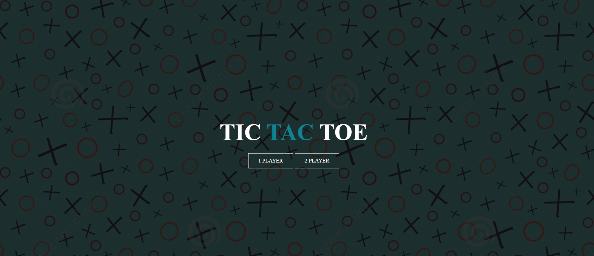
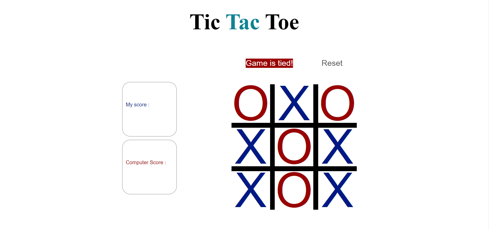
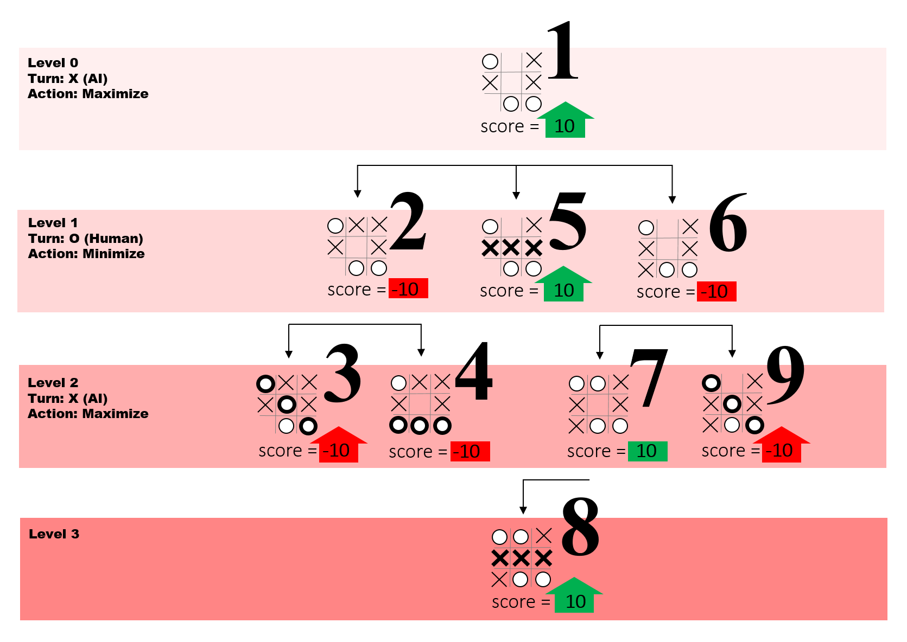

# Project-1-Tic Tac Toe

Tic Tac Toe
 two players or 1 player against the computer, X and O, who take turns marking the spaces in a 3×3 grid. The player who succeeds in placing three of their marks in a diagonal, horizontal, or vertical row is the winner.

Technologies used :

HTML, CSS, & JavaScript (jQuery)

My favorite functions:

MiniMax function is a iterative algorithm used to select a perfect player move assuming the opponent is also playing optimally. As its name suggests, its goal is to reduce maximum loss (reduce worst-case scenario).

Deploy link :

https://pages.git.generalassemb.ly/abdulrahmanjafar/Project-1/
